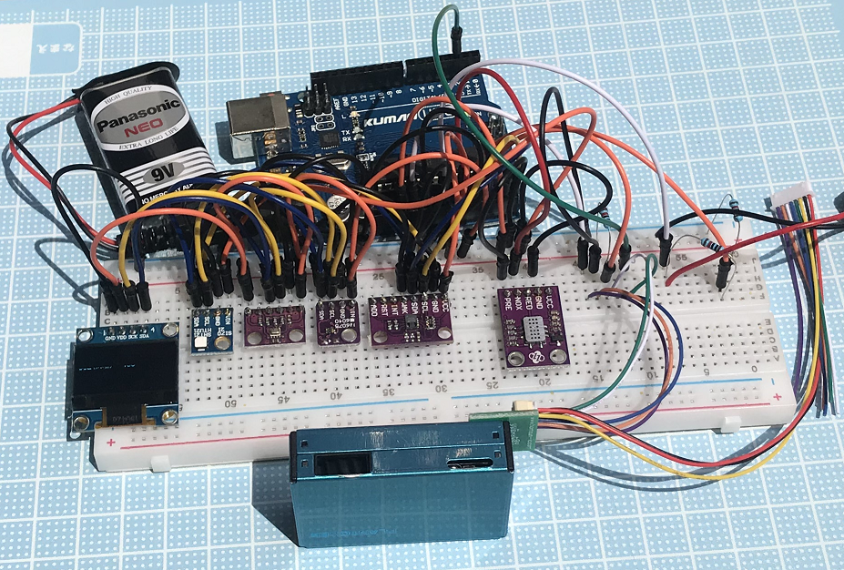

# Another_Weather_Station

Just having some fun with Arduino to build a small portable weather station.

|Sensor|Type|Price (USD)|
|---|---|---|
|HTU21D|Temperature & Humidity|1.44|
|BMP280|Barometric Pressure (and Temperature, not used)|0.83|
|VEML6075|UV index|3.93|
|PMS7003|PM 1.0, 2.5 and 10.0 (ug/m3)|13.00|
|CCS811|CO & TVOC (Total Volatile Organic Compounds)|8.70|
|SSD1306|OLED Screen 128X32|1.86|

MQ131 has also been tested unsuccessfully, its sensitivity is too low for standard NO2 levels in the atmosphere.

As the code uses a lot of memory, more exactly the SSD1306 OLED in 128x64 via malloc call, buffers of the 2 following libraries have been reduced:
* Wire.h BUFFER_LENGTH reduced from 32 to 8 bytes
* twi.h: TWI_BUFFER_LENGTH reduced from 32 to 8 bytes

